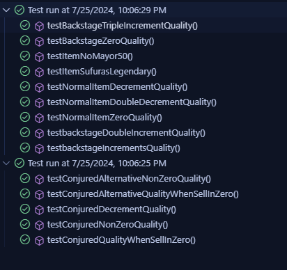

# Kata GildedRose #

## Descripción ##
Bienvenidos al equipo SOE. Hace algun tiempo atras el cliente GildedRose nos pidió realizar un programa para mantener el inventario de sus productos (ítems). En aquella época le encargamos el trabajo a Roberto, que ahora ya no trabaja con nosotros. Ahora el cliente nos ha pedido añadir una nueva funcionalidad al programa. Se desea vender una nueva categoría de ítems.
Primeramente entendamos de qué se trata el sistema:

 - Todos los ítems tienen un valor **sellIn**(venderEn) que indica la cantidad de días que se tiene para vender el item
 - Todos los ítems tienen un valor **Quality** que indica el valor del item.
 - Al final de cada día, el programa baja los valores para cada ítem.

El programa es simple, ¿verdad? En realidad, esto es lo que lo hace interesante:

 - Una vez que la cantidad de días para vender el item ha llegado al punto mínimo (cero días), el **Quality** se degrada el doble de rápido.
 - El **Quality** de un ítem nunca es un número negativo.
 - El item “Aged Brie" incrementa su **Quality** a medida que envejece.
 - El Quality de un ítem nunca es más que 50.
 - El producto “Sulfuras" es legendario y nunca cambia su **Quality**.
 - El item “Backstage passes", como el “Aged Brie", incrementa su **Quality** a medida que se acerca a su valor de **sellIn**: el **Quality** se duplica cuando hay 10 días o menos, se triplica cuando hay 5 días o menos, y se anula cuando se pasó la fecha de venta.

Se ha pedido a Yara implementar la siguiente funcionalidad:
Comercialización de items “Conjured”. Los items “Conjured" (encantados) degradan su **Quality** dos veces mas rapido que los items normales.
Se puede hacer cambios al método **updateQuality** y añadir código mientras todo siga funcionando correctamente. Hay que tener cuidado con la clase Item porque se usa en otros programas. De preferencia no hay que tocarla, pero si puedes hacer cambios para hacer que siga funcionando como antes y alguna funcionalidad extra, está bien.

Una aclaracion final. Un item no puede incrementar su **Quality** mas de 50. El caso especial es “Sulfuras" que es un item legendario y por tanto su calidad es 80 y permanece inalterable.

María mira el código legado y hace una mueca de asombro. No está acostumbrada a ver código verborrágico y poco estructurado. Ella es especialista en TDD y piensa cómo aplicar refactorizaciones en el código y añadir nueva funcionalidad. Luego de un par de horas entrega al responsable de la oficina la siguiente lista de tareas:

 - Anadir pruebas que permitan asegurar que la funcionalidad actual funcionara correctamente a pesar de introducirse cambios en el sistema.
 - Añadir la nueva funcionalidad requerida al programa.
 - Mejorar la clase GildedRose para tener código limpio, legible y extensible.

Fuente original: https://github.com/dshefman/GildedRoseAS3

## Prueba de test unitarios ##

